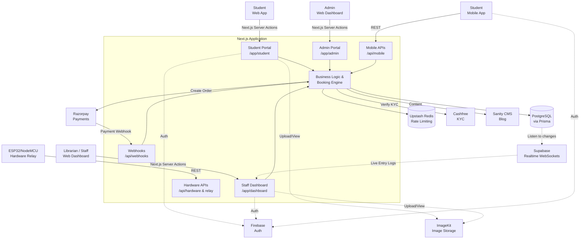
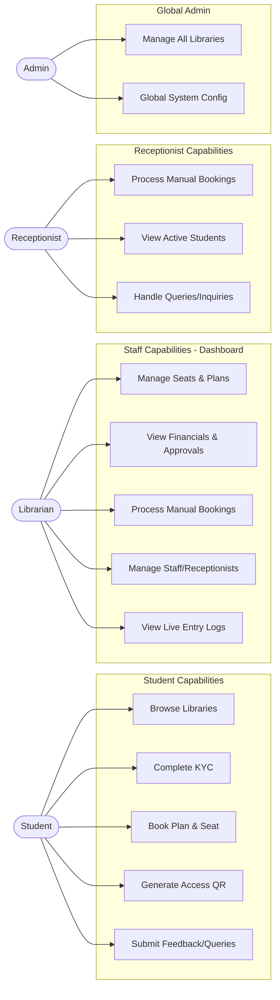
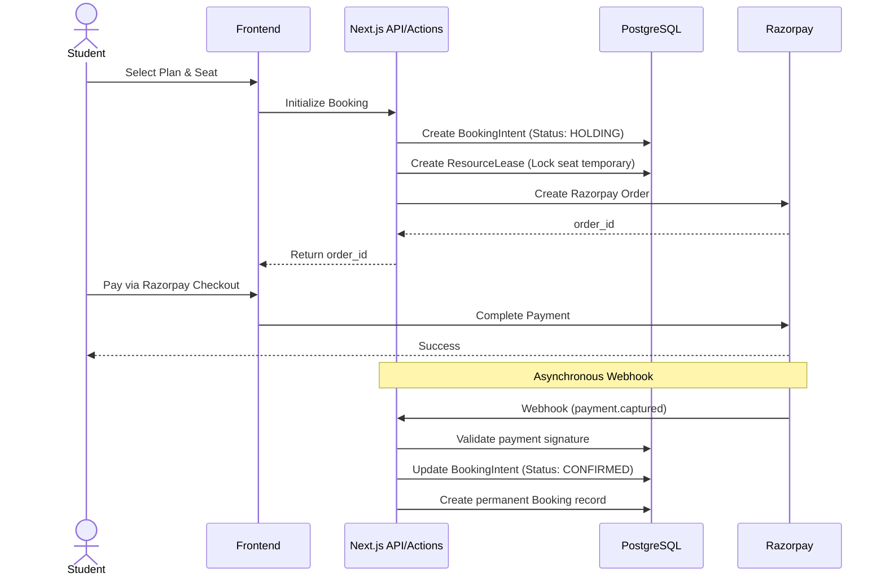
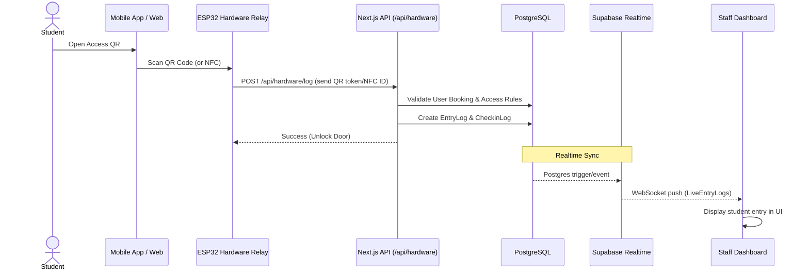
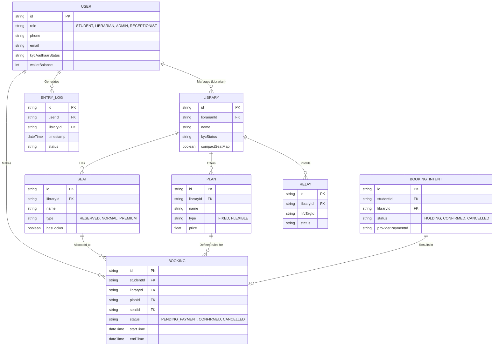

# Architecture Summary

This document describes the current production architecture of the **Library Near** platform, reverse-engineered directly from repository evidence. 

The system is a unified monolith built on **Next.js (App Router)** serving as both the web frontend and the backend API. It supports multiple actors (Students, Librarians, Receptionists, Admins) through distinct web portal sections (`/student`, `/dashboard`, `/admin`) and provides a REST API (`/api/mobile/*`) for a separate mobile application. 

The primary data store is **PostgreSQL**, accessed via **Prisma ORM**. The system relies heavily on third-party services: **Firebase** for core authentication, **Razorpay** for payment processing, **Cashfree** for KYC verification, **ImageKit** for image hosting, and **Sanity** for CMS (Blog). Additionally, the system interfaces with custom ESP32/NodeMCU hardware ("Relays") for physical access control (QR/NFC check-ins) and utilizes **Supabase** for real-time websocket streaming (e.g., live entry logs).

---

# 1. System Overview

---

# 2. Role / Capability Flows

---

# 3. Core Business Workflows

### A. Booking & Payment (Two-Phase Commit)

### B. Hardware Access & Check-In

---

# 4. Data / Domain Model

---

# 5. Permissions / Responsibilities

| Capability / Entity | Student | Receptionist | Librarian | Admin |
|---------------------|---------|--------------|-----------|-------|
| **Own Profile / KYC** | ✅ Read/Write | ❌ | ❌ | ✅ Read |
| **Make Bookings** | ✅ (Online) | ✅ (Manual/Cash) | ✅ (Manual/Cash)| ✅ |
| **Cancel/Refund Bookings** | ⚠️ (Rules apply) | ❌ | ✅ | ✅ |
| **Manage Library Details**| ❌ | ❌ | ✅ (Own Library) | ✅ (All) |
| **Create Plans / Seats** | ❌ | ❌ | ✅ (Own Library) | ✅ (All) |
| **View Financial Reports**| ❌ | ❌ | ✅ (Own Library) | ✅ (All) |
| **View Live Entry Logs** | ❌ | ✅ (Own Library)| ✅ (Own Library) | ✅ (All) |
| **Manage Staff/Roles** | ❌ | ❌ | ✅ (Own Library) | ✅ (All) |
| **Global System Config** | ❌ | ❌ | ❌ | ✅ |

*(Derived from explicit roles in `schema.prisma` and frontend route grouping conventions).*

---

# Grounded Architecture Notes

### Evidence Log
* **Next.js & Structure**: The `src/app` directory utilizes the App Router paradigm. Route groups `(student)`, `dashboard`, and `admin` confirm the multi-tenant/multi-role web architecture.
* **Mobile API**: The existence of `src/app/api/mobile/` with heavy endpoints (`/myspace`, `/checkout/online`, `/qr`) proves a mobile app client interacts with this monolithic backend.
* **Two-Phase Booking Engine**: The database contains `BookingIntent` and `ResourceLease`. Code inside `src/lib/booking-engine` confirms complex booking validation to lock seats before Razorpay payment completion to avoid race conditions.
* **Hardware Integration**: The root directory contains `esp32_qr_access` and `arduino-cli` folders. Schema models `Relay` and `EntryLog`, alongside API routes in `src/app/api/hardware/log` and `/relay/sync` confirm custom IoT hardware acts as physical access gates.
* **Authentication**: Extensive use of Firebase admin (`src/lib/firebase/firebaseAdmin.ts`) and client SDKs. `verify-firebase-token.ts` acts as middleware.
* **KYC / Cashfree**: Verification paths trace to `src/app/api/kyc/cashfree/verify/route.ts` indicating Cashfree is used explicitly for Aadhaar/KYC identity checks.
* **Supabase Realtime**: `schema.prisma` connects to PostgreSQL via Prisma. However, `src/lib/supabase-client.ts` is explicitly imported by frontend components like `LiveEntryLogs.tsx` and `AccessQRModal.tsx`, proving Supabase is used for real-time WebSocket capabilities, directly listening to Postgres changes.

### Known Uncertainties / Unverified Components
* **Notifications Engine**: The schema contains a `Notification` model, and `notification-utils.ts` exists. However, it is not explicitly clear from a brief survey whether web push (VAPID) or Firebase Cloud Messaging (FCM) is the primary delivery mechanism in production.
* **Upstash / Redis Usage**: `@upstash/redis` and `@upstash/ratelimit` are in `package.json` and `src/lib/rate-limit.ts`. It is clearly configured, but its exact saturation across all critical API routes was not exhaustively mapped.
* **Blog/Sanity Usage**: The Sanity CMS integration exists (`src/sanity` and `/blog` routes), but its deployment status relative to the main application is assumed active based on route existence.
* **Cron Jobs / Refunds**: A `refund-worker.ts` exists and `RefundTask` model exists. The execution environment for background cron jobs (e.g., Vercel Cron vs external trigger) is not explicitly established solely from the repository layout.
